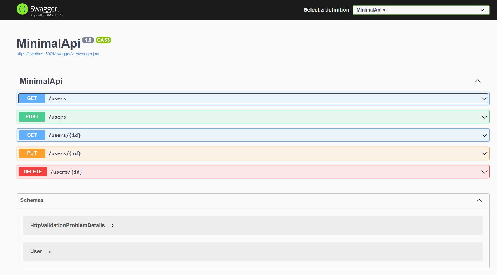

# .Net 6 Minimal API with swagger documentation

This is an example of a minimal API with Swagger documentation written in .Net 6 Core. I have also used
an InMemory database that can easily be replaced with Postgres or SQL. The full article can be found on 
[Medium](https://medium.com/@gerhardmaree/quickly-create-a-net-6-minimal-api-with-swagger-documentation-720d88db79fb)

